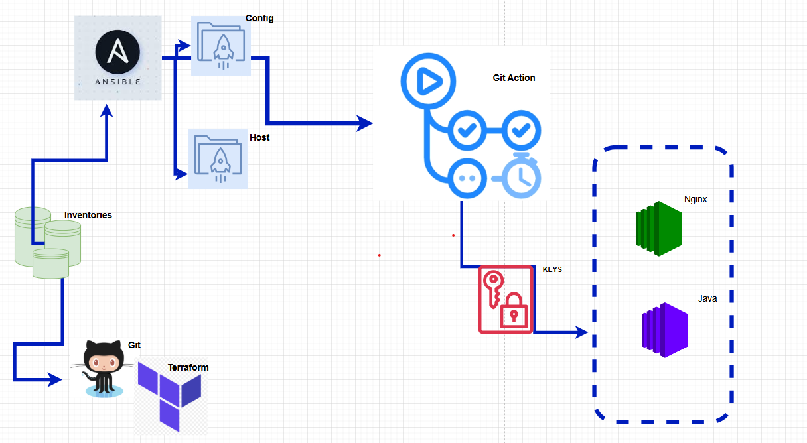
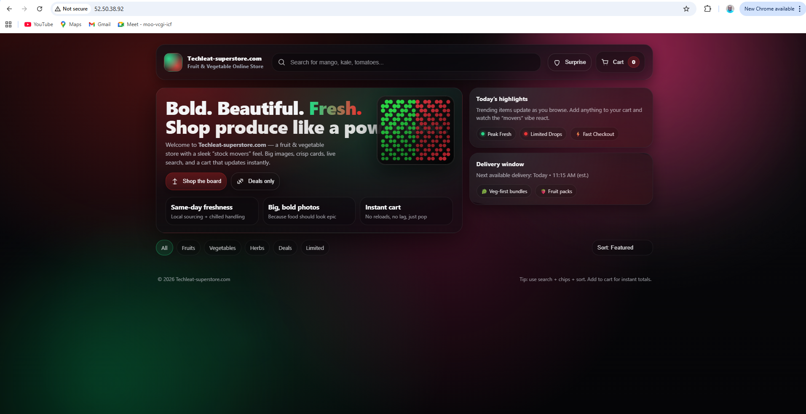

# Class20 AnsibleGit Action

# PART ONE: 
Create a 2 VMs using Terraform and Git-Action as the CICD mechanism. 
Node 1: Java Node 
Node 2: Nginx Node 
Ensure your Terraform code leverages S3 bucket to manage the Terraform State-file 

# PART TWO: 

**(i)** create inventory, Ansible.cfg and playbook to install: 
Install JDK(Java) on Node 1 
Install Nginx (Java) on Node 2 
**(ii)** Ensure sensitive data is kept as secret text (e.g. private ssh key etc) 
**(iii)** Use Git Actions pipeline to run the playbook

